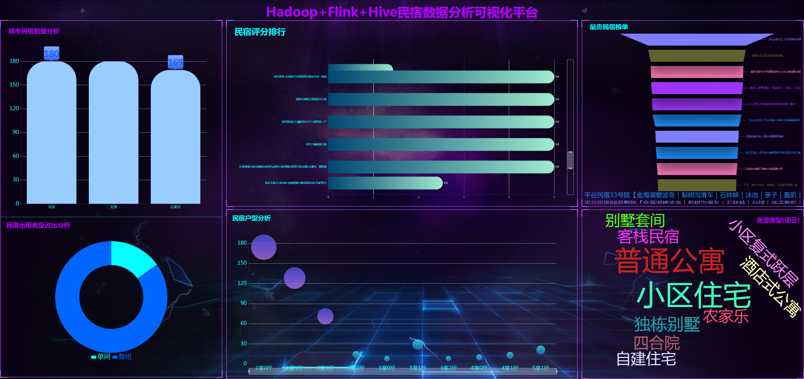
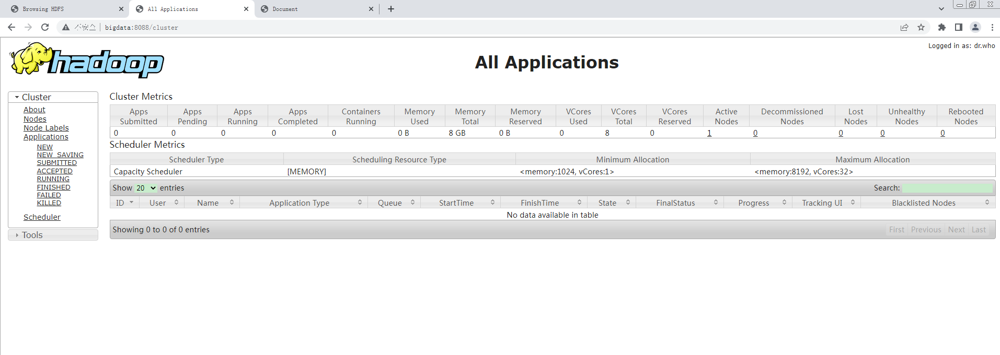
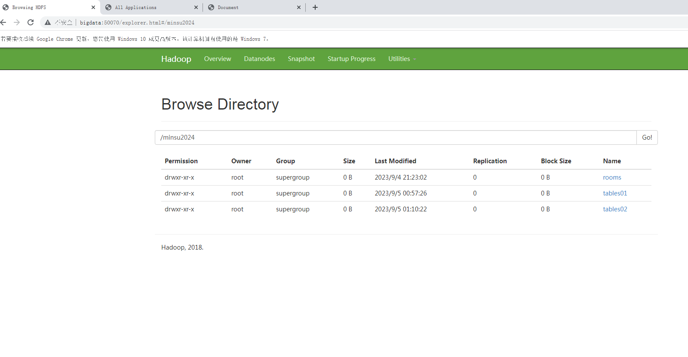
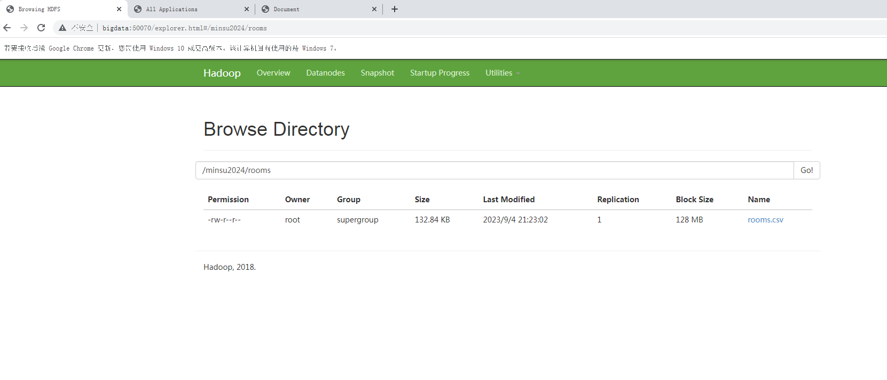
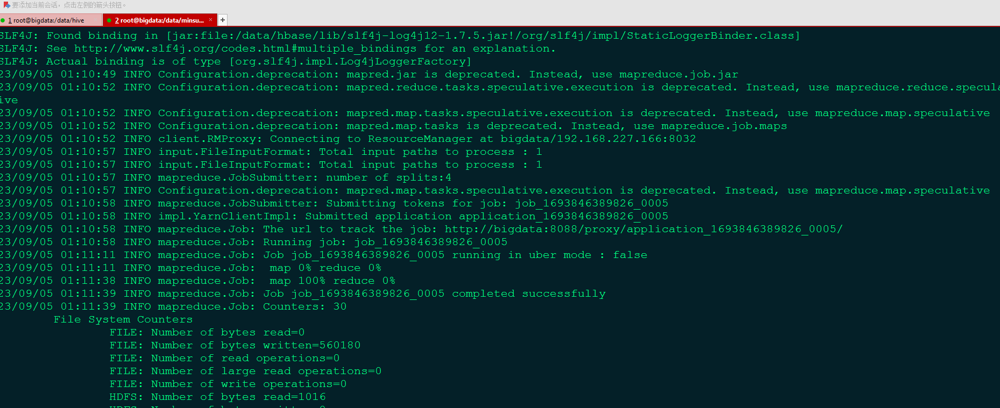
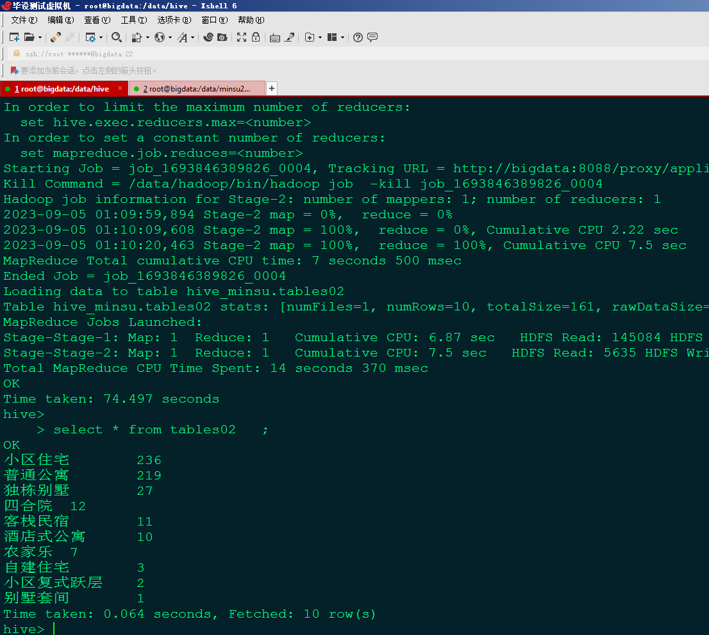
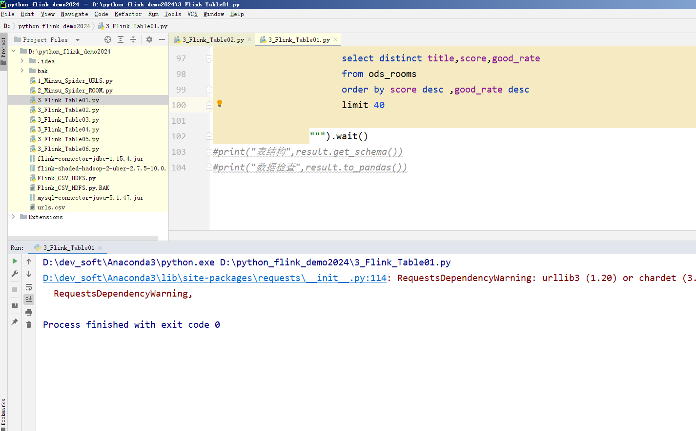
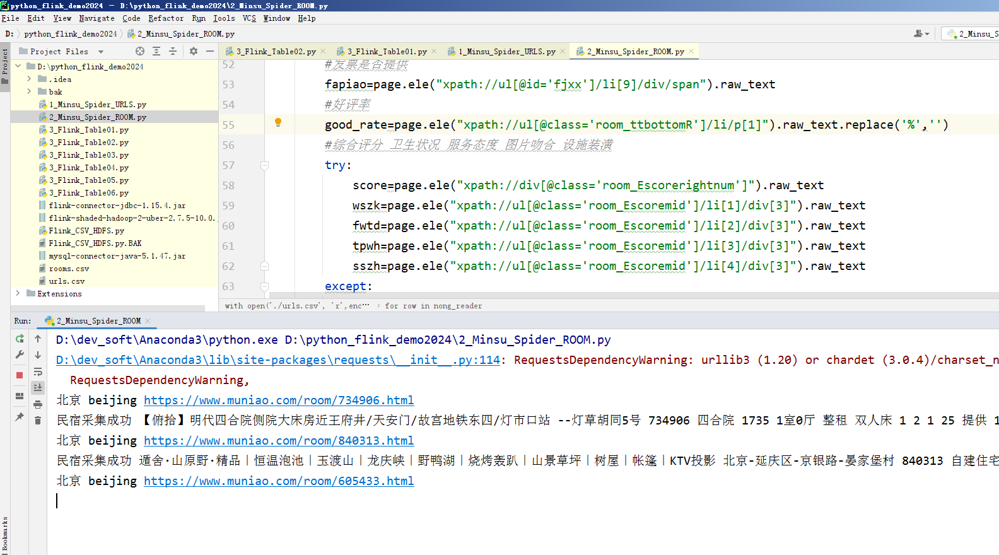
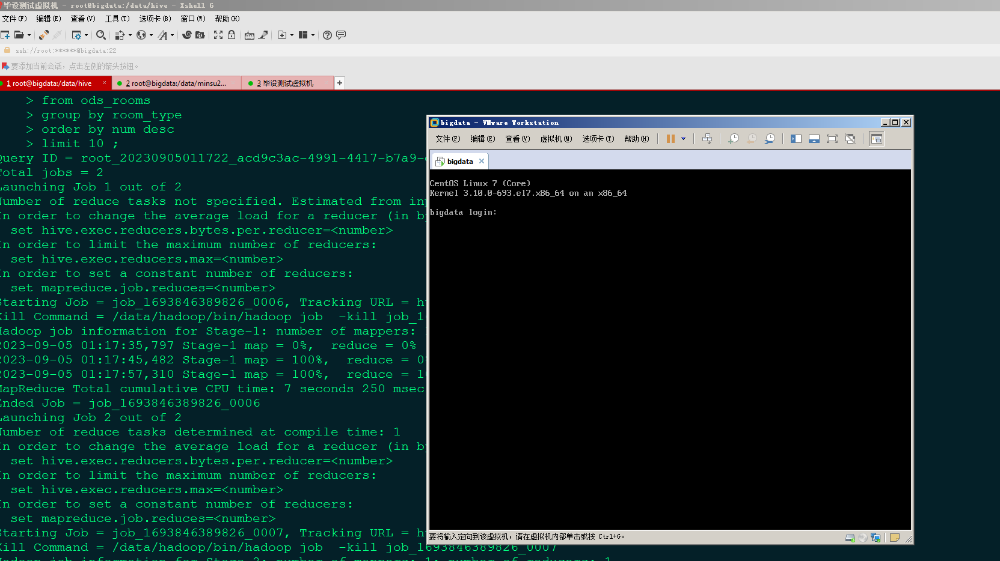

## 计算机毕业设计吊打导师PyFlink+Hadoop+Hive民宿数据分析可视化大屏 民宿推荐系统 民宿爬虫 民宿大数据 知识图谱 机器学习 大数据毕业设计 大数据毕业设计 大数据毕业设计 机器学习 预测系统 数据仓库 大数据毕业设计 文本分类 LSTM情感分析 大数据毕业设计 知识图谱 大数据毕业设计 预测系统 实时计算 离线计算 数据仓库 人工智能 神经网络

## 要求
### 源码有偿！一套(论文 PPT 源码+sql脚本+教程)

### 
### 加好友前帮忙start一下，并备注github有偿hive民宿推荐
### 我的QQ号是2827724252或者798059319或者 1679232425或者微信:bysj2023nb

# 

### 加qq好友说明（被部分 网友整得心力交瘁）：
    1.加好友务必按照格式备注
    2.避免浪费各自的时间！
    3.当“客服”不容易，repo 主是体面人，不爆粗，性格好，文明人。

基础版，也就是当前下面连接这个版本(只带hadoop PyFlink hive flask scrapy爬虫 echarts大屏可视化驾驶舱)

https://www.bilibili.com/video/BV1wN411q7uG/?spm_id_from=333.999.0.0

## 开发技术：
PyFlink hadoop hive 装杯显摆虚拟机Linux敲命令炫酷吊打 flask echarts sqoop PyFlink scala hdfs yarn mysql selenium爬虫框架等；

## 流程： 

1.selenium自动化爬虫框架采集民宿数据约10万条存入.csv文件作为数据集；
2.使用pandas+numpy或MapReduce对数据进行数据清洗，生成最终的.csv文件并上传到hdfs；
3.使用hive数仓技术建表建库，导入.csv数据集；
4.离线分析采用hive_sql完成，实时分析利用Flink之Scala、FlinkSQL完成;
5.统计指标使用sqoop导入mysql数据库；
6.使用flask+echarts进行可视化大屏幕炫酷展示；

## 创新点：
Python爬虫、可视化大屏、离线数仓hive+实时计算PyFlink双结合双实现防止导师喷人、使用vmvare虚拟机模拟大数据环境
0.全新PyFlink而不是Flink!吊打一切！全网都没啥教程！属于最新最屌最流行！
1.selenium爬虫框架；
2.可视化炫酷大屏幕；
3.虚拟机显摆敲命令碾压答辩现场(市面上全是假算法假爬虫假大数据都不带用虚拟机的)；
4.10万海量数据集；
5.Flink实时计算+Hive、Hadoop离线计算双实现有效避免导师喷你；

如果他(导师)还是狂喷不止，继续选择以下的系统，他们可以选装牛鼻功能！

## 可选装项目模块如下(可0秒无缝衔接选装上)：
1.推荐系统(4种深度学习推荐算法 协同过滤基于用户 基于物品 SVD神经网络 MLP)。附带AI、支付、短信、lstm情感分析。
2.预测系统(KNN CNN RNN卷积神经预测 K-means 线性回归)。
3.知识图谱neo4j可视化关系网络图。
4.后台管理系统。

